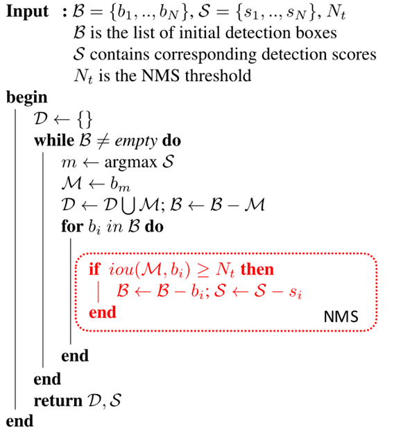

# 1.3. 算法流程

每轮选取置信度最大的 Bounding Box ，接着在所有剩下的 BBox 中逐一与选取的 BBox 计算IoU，对于大于某一置信度的BBox将在这一轮被抑制。这一轮选取的 BBox 会被保留输出，且不会在下一轮出现。接着开始下一轮，重复上述过程：选取置信度最大 BBox ，抑制高 IoU BBox。

- 这是一般文章中介绍的 NMS，比较难懂。但实际上 NMS 的实现反而简单很多。

NMS算法相对较为简单，这里通过两个例子说明。

