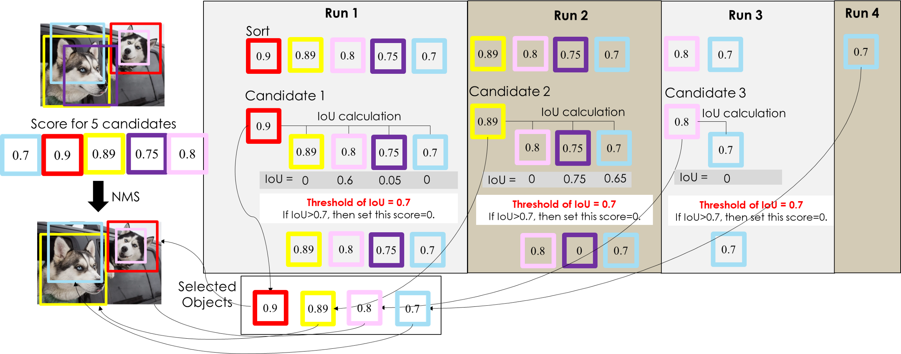

# 1.4. 单类别多目标(例)

例：有2只狗，怎样用 NMS 保证只留下两个 BBox？

前面提到的每个BBox会带有的5个值，但这里我们的重点是怎么检测出狗这个目标，所以这里我们会用到5个信息。其中BBox中心位置 (x,y)和BBox长宽 (h,w)是计算IOU值的。如图：

假设上图中我们捉到5个BBox，每个BBox带有一个score，即代表它是foreground的置信度。

具体步骤如下：

- 第1步：对 BBox 按置信度排序，选取置信度最高的 BBox，放进集合D（所以一开始置信度最高的 BBox 一定会被留下来）；
- 第2步：对剩下的 BBox 和已经选取的 BBox 计算 IoU，淘汰（抑制） IoU 大于设定阈值的 BBox（在图例中这些淘汰的 BBox 的置信度被设定为0）；
- 第3步：重复上述两个步骤，直到所有的 BBox 都被处理完，这时候每一轮选取的 BBox （集合D中的内容）就是最后结果。

算法流程图例如下：

假设阈值为0.5，关于流程图例的详细说明：

- D =  {空集合}  //这里的D代表确定是物体的集合 。
- Run 1：先将BBox按照置信度排序，得出置信度最高的BBox(红色)会被送入集合D内，其他的BBox会与此处产生的最高的BBox进行IoU计算，此时 D={红色BBox}。对于大于0.5的BBox将其置信度设为0，这里的粉色BBox的IoU为0.6>0.5，故将粉色的BBox的置信度设置为0。
- Run 2：这里不用考虑置信度为0和已经在集合D中的BBox，对于剩下的BBox按照置信度排序选出最大的BBox(黄色)，此时D={红色BBox，黄色BBox}，剩下的BBox与Run 2中选出的最大置信度的BBox计算IoU，这里计算之后的IoU均大于0.5，故剩下的BBox的置信度都设置为0。
- 此时，因为没有BBox的置信度大于0，所以结束NMS。最终的 D={红色BBox，黄色BBox}。

这里我们注意到，为什么 IoU 阈值是0.5，能不能再高一点？

倘若我们将IoU阈值提高为0.7，结果又是如何？

通过下面的图例来看一下：

可以看到，NMS 用了更多轮次来确定最终结果，并且最终结果保留了更多的 BBox，即重复检测问题，但结果并不是我们想要的。因此，在使用 NMS 时，IoU 阈值的确定是比较重要的，但一开始我们可以选定 default 值（论文使用的值）进行尝试。