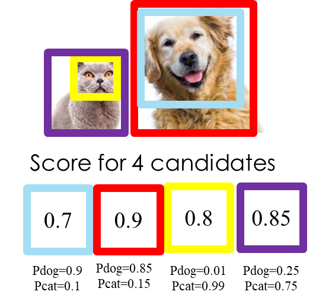
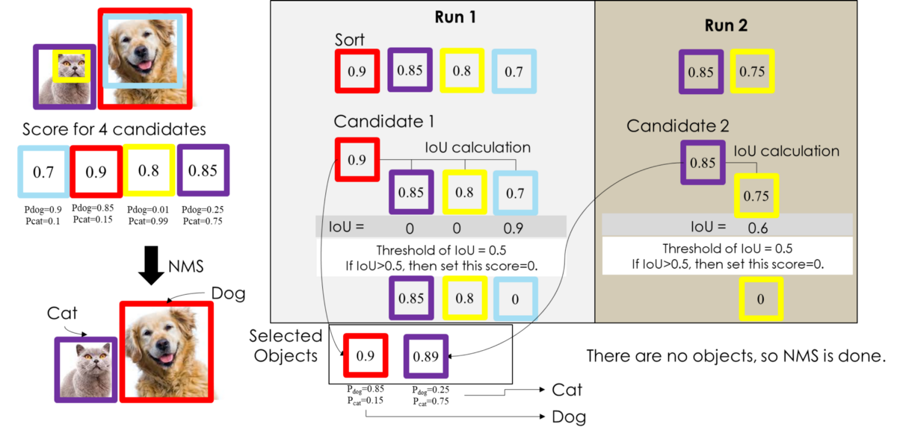

# 1.5. 多类别(例)

吴恩达在 deep learning 专项课程中指出，如果有多个分类，正确做法应该是运行多次独立的NMS，每次针对一种输出分类。

吴恩达课程链接：[Non-max Suppression](https://www.coursera.org/lecture/convolutional-neural-networks/non-max-suppression-dvrjH)

例：有一只猫和一只狗，我们怎么用NMS将检测到的物体框把猫咪和狗子框出来。

如图：

前面提到的单类别多目标范例是一个标准的NMS程序，这还要搭配分类来看。这里的例子和NMS做法一样，现将集合D（确定是物体的集合）选出来，从图中我们可以看到NMS选出来的D={紫色BBox，红色BBox}。

在算法过程中，结合分类的概率，在每个NMS选出的BBox中做类别判断，流程如下：

至此，对NMS应该有初步的了解。