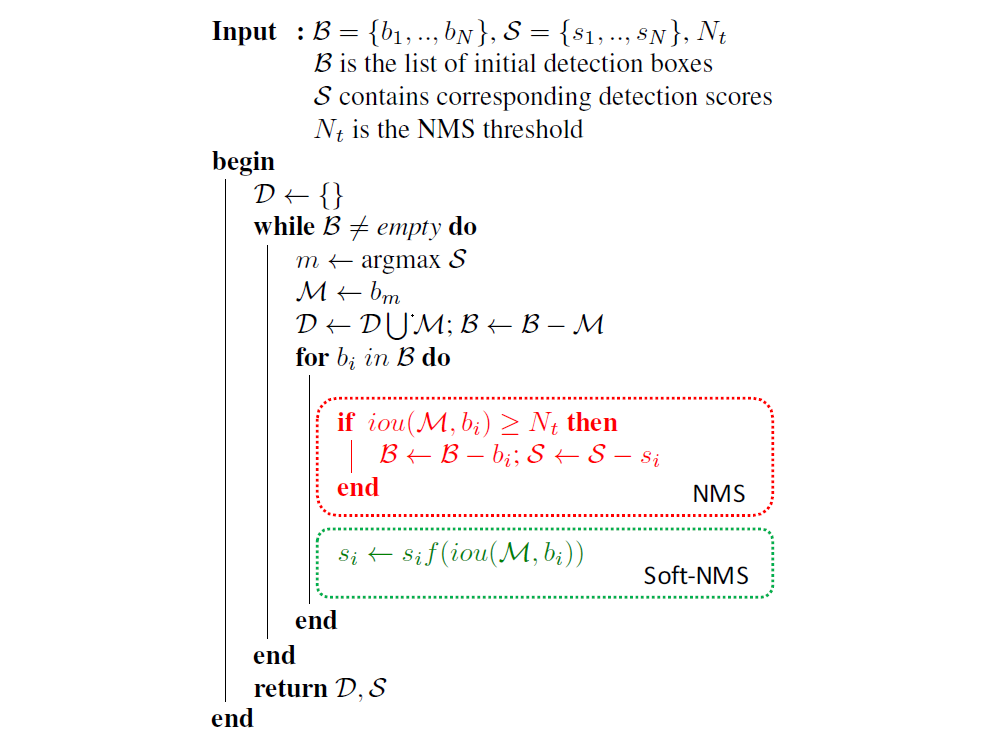

# 2.1. 算法流程

NMS算法略显粗暴，因为NMS直接将删除所有IoU大于阈值的框。soft-NMS吸取了NMS的教训，在算法执行过程中不是简单的对IoU大于阈值的检测框删除，而是降低得分。算法流程同NMS相同，但是对原置信度得分使用函数运算，目标是降低置信度得分，其伪代码如图所示：

$b_i$ 为待处理BBox框，B为待处理BBox框集合，$s_i$ 是 $b_i$ 框更新得分，$N_t$ 是NMS的阈值，D集合用来放最终的BBox，f是置信度得分的重置函数。$b_i$ 和M的IOU越大，$b_i$ 的得分$s_i$就下降的越厉害。

经典的NMS算法将IOU大于阈值的窗口的得分全部置为0，可表述如下：
$$
\Large
s_i=
\begin{cases}
s_i, &iou(M,b_i)<N_t\\
0, &iou(M,b_i)\geq N_t
\end{cases}
$$
论文置信度函数有两种形式的改进：

- 方法一：线性加权
  $$
  \Large
  s_i=
  \begin{cases}
  s_i, &iou(M,b_i)<N_t\\
  s_i(1-iou(M,b_i)), &iou(M,b_i)\geq N_t
  \end{cases}
  $$
  
- 方法二：高斯加权
  $$
  \LARGE
  s_i=s_ie^{-\frac{iou(M,b_i)^2}{\sigma}},\forall b_i \notin \mathcal D
  $$

