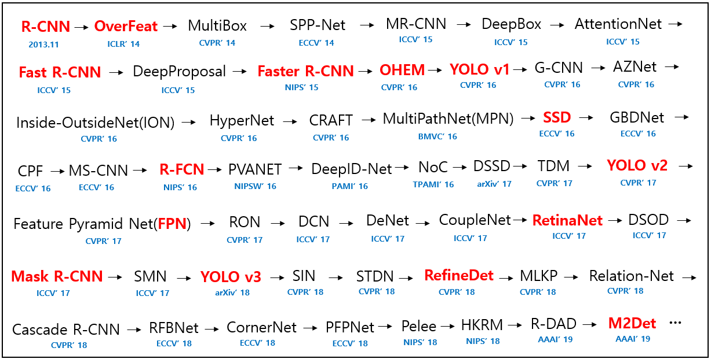

# Introduction

目标检测（Object Detection）的任务是找出图像或视频中的感兴趣目标，同时实现输出检测目标的位置和类别，是视觉领域的核心问题之一，学术界已有将近二十年的研究历史。随着深度学习技术的火热发展，目标检测算法也从基于手工特征的传统算法转向了基于深度神经网络的检测技术。从最初 2013 年提出的 R-CNN、OverFeat，到后面的 Fast/Faster R-CNN、SSD、YOLO 系列，以及Mask R-CNN、RefineDet、RFBNet等（如下图所示），短短不到6年时间，基于深度学习的目标检测技术取得了巨大的突破。在网络结构上，从 two stage 到 one stage，从 bottom-up only 到 Top-Down，从 single scale network 到 feature pyramid network，从面向 PC 端到面向移动端，都涌现出许多好的算法技术，这些算法在开放目标检测数据集上的检测效果和性能都很出色。

    目标检测过程中有很多不确定因素，如图像中目标数量不确定，目标有不同的外观、形状、姿态，加之物体成像时会有光照、遮挡等因素的干扰，导致检测算法有一定的难度。当前，目标检测发展主要集中在两个方向：以Region Proposal为主要步骤的RCNN系列方法以及以end-to-end为主要步骤的Yolo、SSD系列方法。两者的主要区别在于two stage算法需要先生成proposal（一个有可能包含待检物体的预选框），然后进行细粒度的物体检测。而one stage算法会直接在网络中提取特征来预测物体分类和位置。
    two stage算法以及部分one stage算法（SSD系列），都需要对Region Proposal去重。比如经典的Faster RCNN算法会生产2000的Region Proposal，如果对所有的检测框进行分类和处理，会造成大量无效计算。而此时使用某些算法对检测框去重，是目标检测领域的一个重要方向。
    这里介绍目标检测中使用的检测框去重方法，包括NMS，Soft-NMS,Softer-NMS等。在目标检测中，常会利用非极大值抑制算法(**NMS**，Non Maximum Suppression)对生成的大量候选框进行后处理，去除冗余的候选框，得到最佳检测框，以加快目标检测的效率。其本质思想是搜素局部最大值，抑制非极大值。非极大值抑制也在计算机视觉任务中得到了广泛的应用，例如边缘检测、人脸检测、目标检测（DPM，YOLO，SSD，Faster R-CNN）等。

