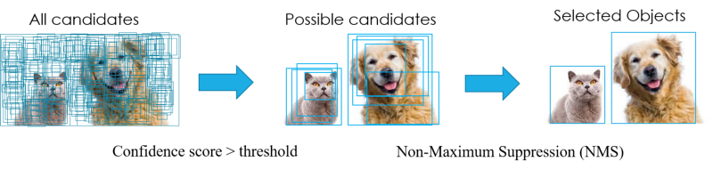

# 1.6. 常用流程

现实中，在正式使用NMS之前，通常会有一个候选框预清理的工作，即先用一个阈值先初步去掉一些候选BBox，不然假设一张图有一万个BBox，后面用计算NMS会很耗费时间，所以会依据BBox的confidence score先去掉一些没用的BBox，然后再做NMS，如下图：

- two-stage算法

  通常在选出BBox时只会带有BBox中心位置(x,y)、BBox长宽(h,w)和confidence score，不会有类别的概率，因为程序执行的方式是先退出BBox，再将选出的BBox的feature map做rescale（一般用ROI pooling）,然后再用分类器分类。

- one-stage算法

  BBox带有BBox中心位置(x,y)、BBox长宽(h,w)和confidence score，也会有类别的几率。相对于two-stage少了后面的rescale和分类的程序，所以计算量相对较小。

**补充说明：**若two-stage选出300个BBox，后面ROI pooling计算过程中很耗费时间，所以one-stage的做法是目前比较主流的。要在速度和精度上有所提升，计算量（参数量）和mAP目前是trade offs，若减少参数量的同时可以提高mAP，这是目标检测算法的目标。当前目标压缩的算法也有很多，如Pruning、Quantization、Low-rank factorization、Transferred/compact constitutional filters 和 Knowledge distillation等，可以自行查阅。