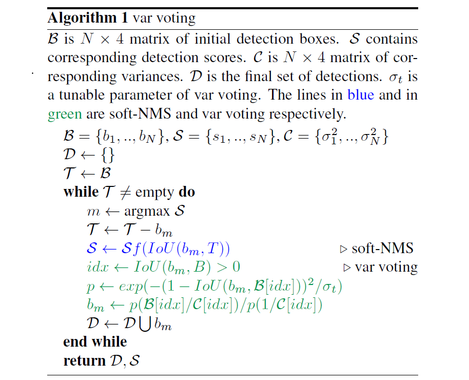

# 3.3. 算法流程

论文假设Bounding box为高斯分布：
$$
\Large
P_\Theta (x)=\frac{1}{2\pi\sigma^2}e^{-\frac{(x-x_e)^2}{2\sigma^2}}
$$
ground truth符合delta分布：
$$
\Large
P_D(x)=\delta(x-x_g)
$$
KL散度可表示为：
$$
\Large
\hat\Theta={\arg\min}_{\Theta}D_{KL}(P_D(c)||P_\Theta(x))
$$
推导过程详见原文，重点看作者推导的KL Loss：
$$
\Large
L_{reg}=\alpha(|x_g-x_e|-\frac{1}{2})-\frac{1}{2}log(\alpha+\epsilon)
$$
是不是和L1正则化很像？是不是预测的Bounding box与ground truth的曼哈顿距离的一维表示？

如图所示Softer-NMS的实现过程，其实很简单，预测的四个顶点坐标，分别对$IoU>N_t$的预测加权平均计算，得到新的4个坐标点。第$i$个box的$x_1$计算公式如下（j表示所有$IoU>N_t$的box）：
$$
\Large
x1_i:=\frac{\sum_jx1_j/\sigma_{x1,j}^2}{\sum_j1/\sigma_{x1,j}^2}
$$

$$
\Large
subject\space to \space IoU(x1_j,x1_i)>N_t
$$

考虑特殊情况，可以认为是预测坐标点之间求平均值。

